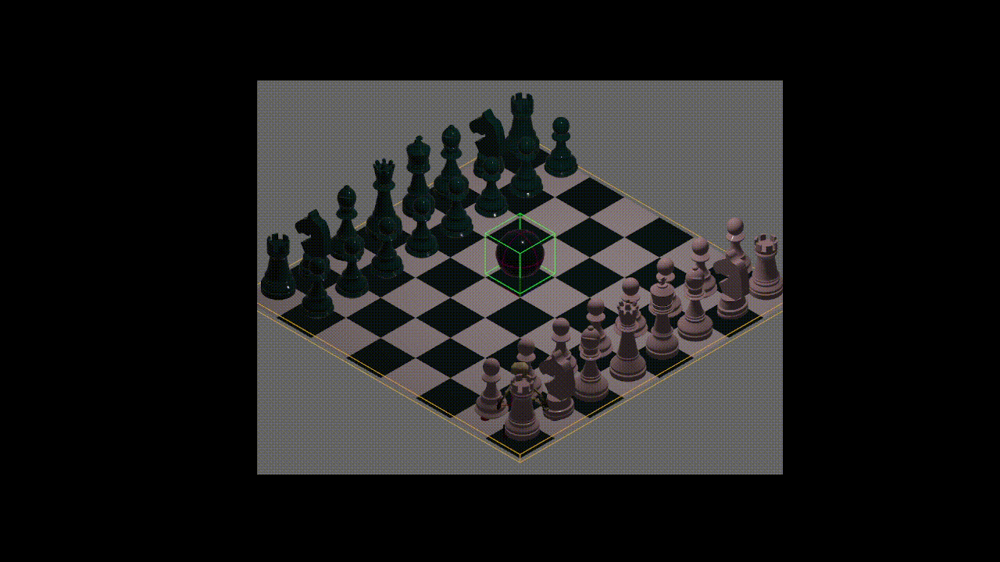

# bastion-like



## Success list:

- [x] Load 3D models asset
  - useful links: 
    - https://github.com/bevyengine/bevy/tree/v0.7.0/examples/animation
    - https://bevy-cheatbook.github.io/3d/gltf.html
- [x] Move skelly with arrow keys
- [x] Rotate skelly according to where he's facing
- [x] Add all animations
  - [x] yell
  - [x] attack
  - [x] run
  - [x] die
- [x] Add physic => https://rapier.rs/
  - Links
    - https://www.rapier.rs/docs/user_guides/bevy_plugin/getting_started_bevy
    - https://github.com/dimforge/bevy_rapier/tree/master/bevy_rapier3d/examples
    - https://www.reddit.com/r/bevy/comments/uoqmm0/gryazevichki_vehicle_simulation_prototype_using/
    - https://www.reddit.com/r/bevy/comments/sz06sc/how_to_properly_handle_rapier_collision_events/
  - [x] Collision
  - [x] Gravity
- [ ] Add a castle model!
  - [ ] Model in gltf
    - learn a bit about this format
  - [ ] Add an inspector Camera that follows the model to place it

## Meshes and 3D models

### Skeleton

- https://sketchfab.com/3d-models/rpg-lowpoly-skeleton-6b3cb0f76a7540f7968e785c68058883
- https://free3d.com/3d-model/fantasy-castle-40715.html

### Export using Unity to FBX or whatever

- https://youtu.be/eaTeHHe7T5o


Hello! :)
I'm having trouble to handle multiple AnimationPlayer objets. 
I am perfectly ok with only one AnimationPlayer, but with more than one...

Right now I have a Bundle for spawning creatures: 
```rust
#[derive(Bundle)]
pub struct Creature  {
    pub hashmap_animations: HashMapAnimations,
    
    /*
    other stuff like health, transform etc.    
     */
}

#[derive(Component)]
pub struct HashMapAnimations {
  pub current_animation_id: i32,
  pub hash_animations: HashMap<i32, SingleAnimation>,
}

pub struct SingleAnimation {
  pub id: i32,
  pub handle: Handle<AnimationClip>,
  pub duration: f32,
  pub is_repeatable: bool,
}

```

But when I want to update their animation, I would do :

```rust

fn setup(mut commands: Commands, asset_server: Res<AssetServer>) {
  let mut hash_animations_1 = creatures::HashMapAnimations::default();
  
  hash_animations_1.add_animation(
    1,
    asset_server.load("models/creature_1/scene.gltf#Animation1"),
    1.58,
    true,
  );
  
  /* other animations */

  commands
          .spawn()
          .insert_bundle(creatures::Creature {
            hashmap_animations: hash_animations_1,
            /*
            other stuff
            */
          })
          .with_children(|parent| {
            parent.spawn_scene(asset_server.load("models/skeleton/scene.gltf#Scene0"));
          });


  let mut hash_animations_2 = creatures::HashMapAnimations::default();

  hash_animations_2.add_animation(
    1,
    asset_server.load("models/creature_2/scene.gltf#Animation1"),
    1.58,
    true,
  );

  /* other animations */

  commands
          .spawn()
          .insert_bundle(creatures::Creature {
            hashmap_animations: hash_animations_2,
            /*
            other stuff
            */
          })
          .with_children(|parent| {
            parent.spawn_scene(asset_server.load("models/skeleton/scene.gltf#Scene0"));
          });
}

fn update_animation(
    mut animation_players: Query<(Entity, &mut AnimationPlayer)>,
    mut query_creature: Query<&HashMapAnimations>,
) {
    
    for (e, mut player) in animation_players.iter_mut() {
        // how do I know if player if for creature one or two?
    }

} 
    
```

Thanks!