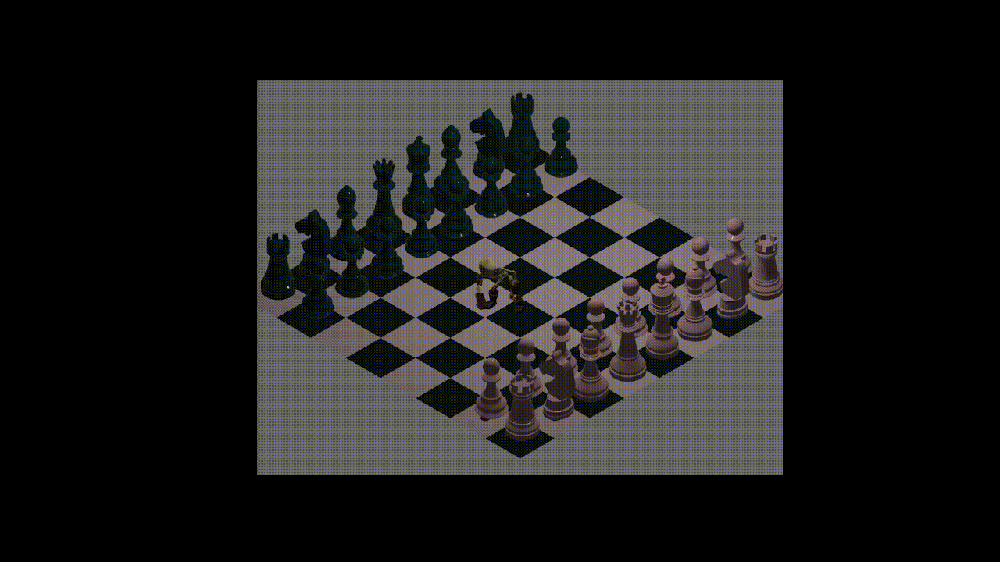

# bastion-like

## Success list:

- [x] Load 3D models asset
  - useful links: 
    - https://github.com/bevyengine/bevy/tree/v0.7.0/examples/animation
    - https://bevy-cheatbook.github.io/3d/gltf.html
- [x] Move skelly with arrow keys
- [x] Rotate skelly according to where he's facing
- [ ] Add all animations
  - [ ] yell
  - [ ] attack
  - [ ] run
- [ ] Add physic => https://rapier.rs/
  - [ ] Collision
  - [ ] Gravity

## Meshes and 3D models

### Skeleton

- https://sketchfab.com/3d-models/rpg-lowpoly-skeleton-6b3cb0f76a7540f7968e785c68058883